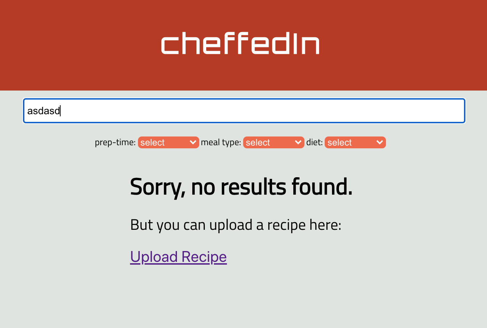
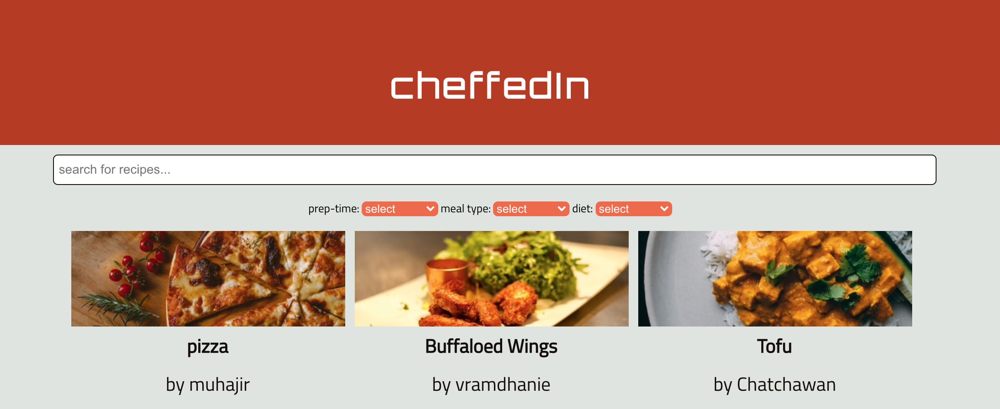
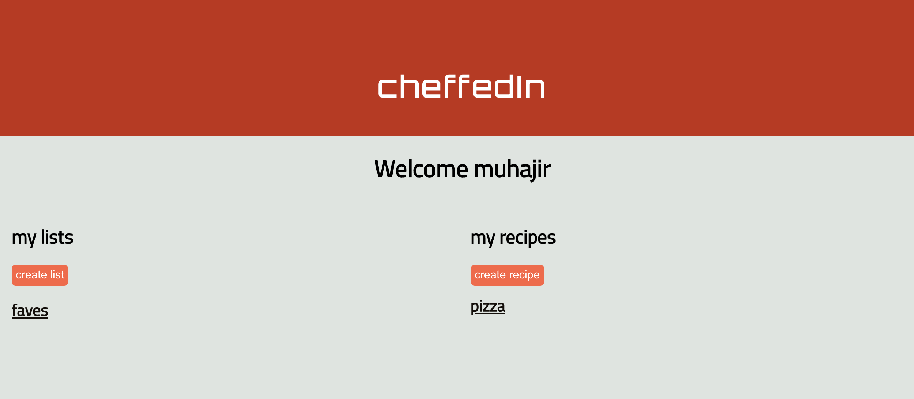
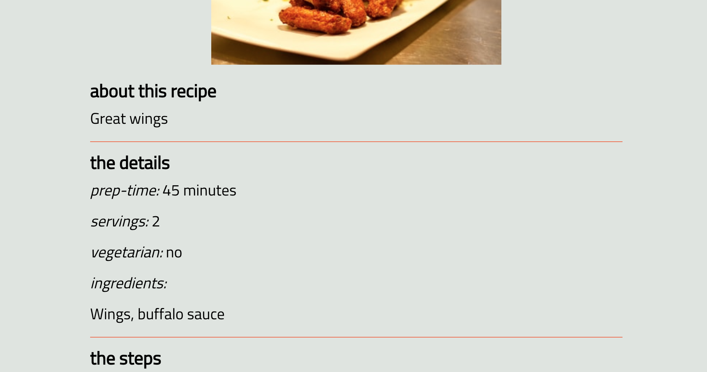
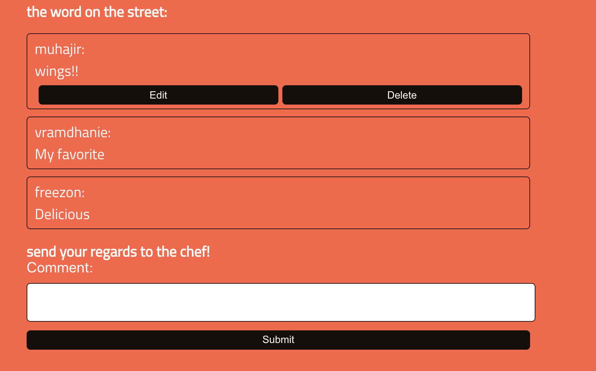

# cheffedIn

(https://cheffedin-capstone.vercel.app/)

## Summary

This app was built during COVID-19, a time which saw more people staying at home, as well as making more meals at home and experimenting with more varieties of cooking. This app is designed to allow users to share their recipes with others, search for recipes uploaded by other users, save recipes from other users to their own lists so that they can try them later, and interact with other users through commenting on recipes.

This project was built using React for the front end, Express for the API, and postgreSQL for the Database. The client is deployed to Vercel, and the server and database is deployed to Heroku. 

Client code can be viewed here (https://github.com/M-Sayer/Capstone-Client)